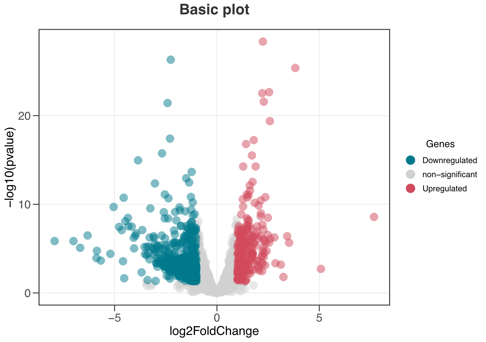
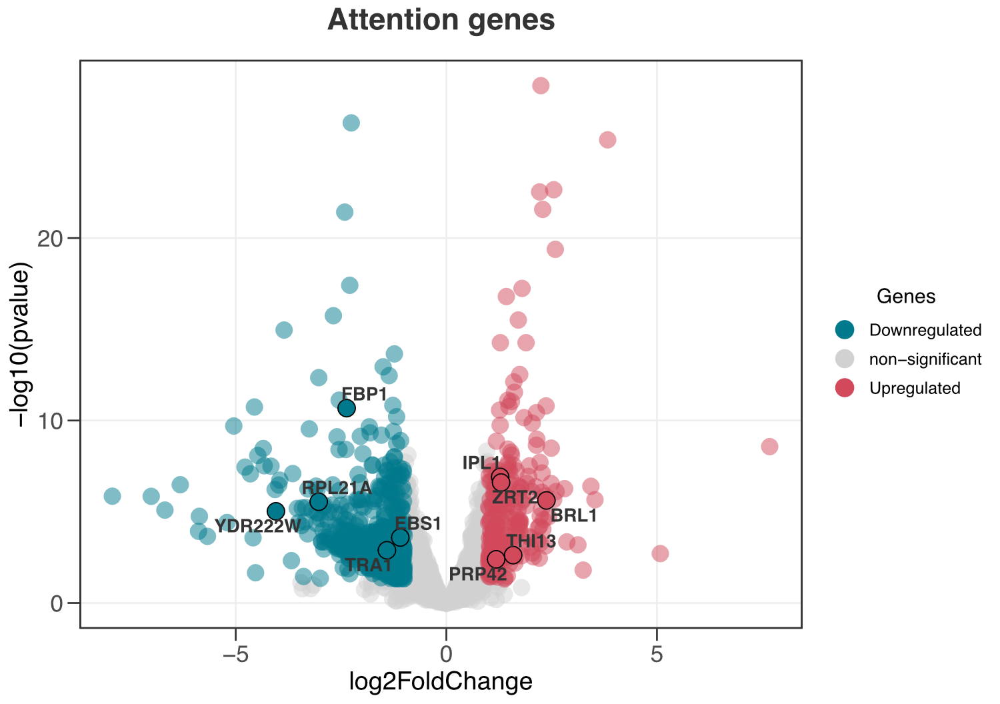
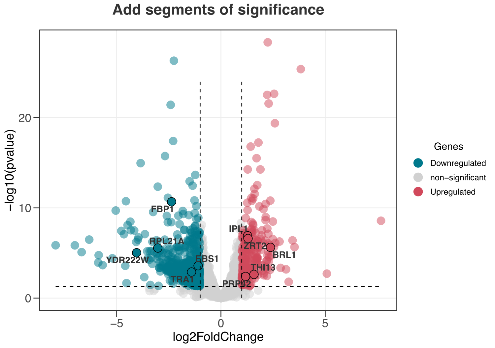
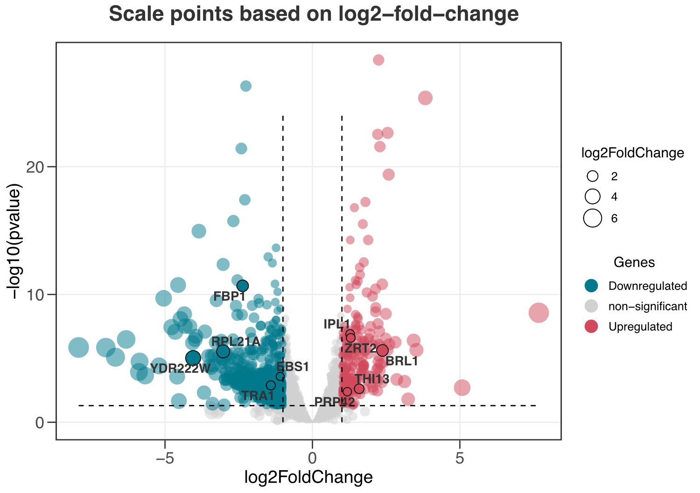
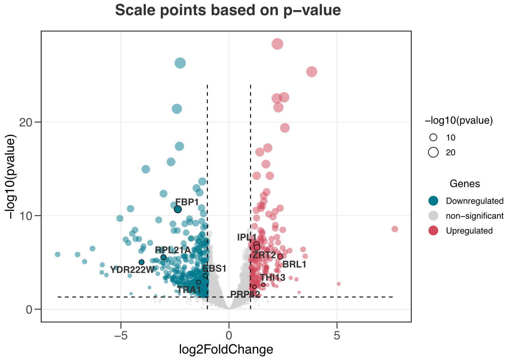
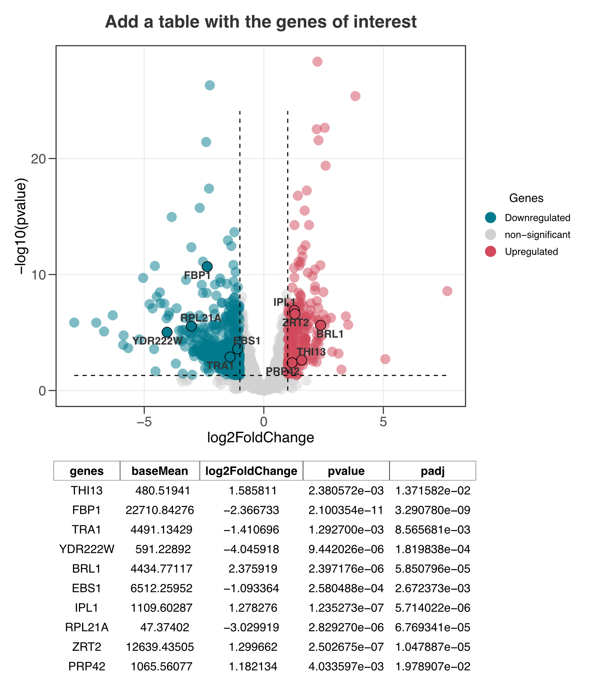

[](https://cran.r-project.org/package=ggvolc)
[](https://opensource.org/licenses/MIT)
[](https://cran.r-project.org/package=ggvolc)

## Install the `ggvolc` package
Install the package using the following commands  

```r
# for now, you can install the developmental version of ltc
# first you need to install the devtools package 
# in case you have not already installed
install.packages("devtools") 
# and load it
library(devtools)

# then you can install the dev version of the ltc
devtools::install_github("loukesio/ggvolc")
# and load it
library(ggvolc)
```


<br>


### How do I start?
Load the library and explore the example datasets! 

```console
library(ggvolc)
#> Welcome to ggvolc version 0.1.0 !
#> 
#>                                 888
#>                                 888
#>                                 888
#>  .d88b.   .d88b.  888  888  .d88b.  888  .d8888b
#> d88P"88b d88P"88b 888  888 d88""88b 888 d88P"
#> 888  888 888  888 Y88  88P 888  888 888 888
#> Y88b 888 Y88b 888  Y8bd8P  Y88..88P 888 Y88b.
#>  "Y88888  "Y88888   Y88P    "Y88P"  888  "Y8888P
#>      888      888
#> Y8b d88P Y8b d88P
#>  "Y88P"   "Y88P"
#>
```
```
data(all_genes)     # data.frame that contains the output of differentially expressed genes
head(all_genes,5)   # have a look at the first 5 rows 

#>       genes   baseMean log2FoldChange     lfcSE       stat       pvalue
#> 1      GCR1  7201.5782       2.244064 0.2004959  11.192564 4.434241e-29
#> 2     OPI10  1009.4171      -2.257454 0.2096469 -10.767889 4.880607e-27
#> 3      AGA2   249.1173       3.829474 0.3623263  10.569132 4.143136e-26
#> 4 FIM1_1376  5237.5035       2.550409 0.2560379   9.961059 2.256459e-23
#> 5      HMG1 10838.1037       2.214300 0.2229065   9.933763 2.968371e-23
#>           padj
#> 1 2.153711e-25
#> 2 1.185255e-23
#> 3 6.707736e-23
#> 4 2.739905e-20
#> 5 2.883475e-20


data(attention_genes)     # here is a data.frame with genes that I want to mention to the volcano plot
head(attention_genes,5)   # have a look at the first five rows 
#>     genes   baseMean log2FoldChange     lfcSE      stat       pvalue
#> 1   THI13   480.5194       1.585811 0.5219706  3.038122 2.380572e-03
#> 2    FBP1 22710.8428      -2.366733 0.3533032 -6.698871 2.100354e-11
#> 3    TRA1  4491.1343      -1.410696 0.4384316 -3.217595 1.292700e-03
#> 4 YDR222W   591.2289      -4.045918 0.9133881 -4.429572 9.442026e-06
#> 5    BRL1  4434.7712       2.375919 0.5037264  4.716686 2.397176e-06
#>           padj
#> 1 1.371582e-02
#> 2 3.290780e-09
#> 3 8.565681e-03
#> 4 1.819838e-04
#> 5 5.850796e-05
```
<sup>Created on 2023-08-11 with [reprex v2.0.2](https://reprex.tidyverse.org)</sup>


### 1. Plot a simple volcano plot! 

Install the package using the following commands 

```
ggvolc(all_genes)
```


### 2. Add the genes of attention.

```
ggvolc(all_genes, attention_genes)
```


### 3. Add segments to indicate areas of significance.

```
ggvolc(all_genes, attention_genes, add_seg = TRUE) +
  labs(title="Add segments of significance")
```


### 4. Indicate the size of point based on the log2FoldChange column.

```
ggvolc(all_genes, attention_genes, size_var = "log2FoldChange", add_seg = TRUE)
```


###  5. Indicate the size of the point based on the pvalue.

```
ggvolc(all_genes, attention_genes, size_var = "pvalue", add_seg = TRUE)
```


###  6. Add a table with the genes of interest.

```
plot <- ggvolc(all_genes, attention_genes, add_seg = TRUE) +
  labs(title="Add a table with the genes of interest")

plot %>%
  genes_table(attention_genes)
```




