<!-- README.md is generated from README.Rmd. Please edit that file and run
     devtools::build_readme() to regenerate README.md. -->

[](https://cran.r-project.org/package=ggvolc)
[](https://opensource.org/licenses/MIT)
[](https://cran.r-project.org/package=ggvolc)

## Install the `ggvolc` package

Install the package using the following commands 

``` r
# you can install ggvolc from CRAN 
install.packages("ggvolc")

# if you want to install the developmenetal version please use
devtools::install_github("loukesio/ggvolc")
# and load it
library(ggvolc)
```

<br>

### How do I start?

`ggvolc` turns the results of a differential-expression analysis — from **DESeq2**,
**edgeR**, or **limma** — into a clean, publication-ready volcano plot. From there
you can highlight genes, auto-label the top hits, attach a `gt` table, or make the
whole thing interactive. Start by loading the library and exploring the two example
datasets that ship with the package:

``` console
library(ggvolc)
#> Welcome to ggvolc version 0.3.0 !
#>
#>                                 888
#>                                 888
#>                                 888
#>  .d88b.   .d88b.  888  888  .d88b.  888  .d8888b
#> d88P"88b d88P"88b 888  888 d88""88b 888 d88P"
#> 888  888 888  888 Y88  88P 888  888 888 888
#> Y88b 888 Y88b 888  Y8bd8P  Y88..88P 888 Y88b.
#>  "Y88888  "Y88888   Y88P    "Y88P"  888  "Y8888P
#>      888      888
#> Y8b d88P Y8b d88P
#>  "Y88P"   "Y88P"
#>
```

    data(all_genes)     # data.frame that contains the output of differentially expressed genes
    head(all_genes,5)   # have a look at the first 5 rows

    #>       genes   baseMean log2FoldChange     lfcSE       stat       pvalue
    #> 1      GCR1  7201.5782       2.244064 0.2004959  11.192564 4.434241e-29
    #> 2     OPI10  1009.4171      -2.257454 0.2096469 -10.767889 4.880607e-27
    #> 3      AGA2   249.1173       3.829474 0.3623263  10.569132 4.143136e-26
    #> 4 FIM1_1376  5237.5035       2.550409 0.2560379   9.961059 2.256459e-23
    #> 5      HMG1 10838.1037       2.214300 0.2229065   9.933763 2.968371e-23
    #>           padj
    #> 1 2.153711e-25
    #> 2 1.185255e-23
    #> 3 6.707736e-23
    #> 4 2.739905e-20
    #> 5 2.883475e-20


    data(attention_genes)     # here is a data.frame with genes that I want to mention to the volcano plot
    head(attention_genes,5)   # have a look at the first five rows
    #>     genes   baseMean log2FoldChange     lfcSE      stat       pvalue
    #> 1   THI13   480.5194       1.585811 0.5219706  3.038122 2.380572e-03
    #> 2    FBP1 22710.8428      -2.366733 0.3533032 -6.698871 2.100354e-11
    #> 3    TRA1  4491.1343      -1.410696 0.4384316 -3.217595 1.292700e-03
    #> 4 YDR222W   591.2289      -4.045918 0.9133881 -4.429572 9.442026e-06
    #> 5    BRL1  4434.7712       2.375919 0.5037264  4.716686 2.397176e-06
    #>           padj
    #> 1 1.371582e-02
    #> 2 3.290780e-09
    #> 3 8.565681e-03
    #> 4 1.819838e-04
    #> 5 5.850796e-05

<sup>Created on 2023-08-11 with [reprex v2.0.2](https://reprex.tidyverse.org)</sup>

### 1. Plot a simple volcano plot!

Pass a single data frame and every gene is coloured by significance — down, up,
or not significant.

``` r
ggvolc(all_genes)
```

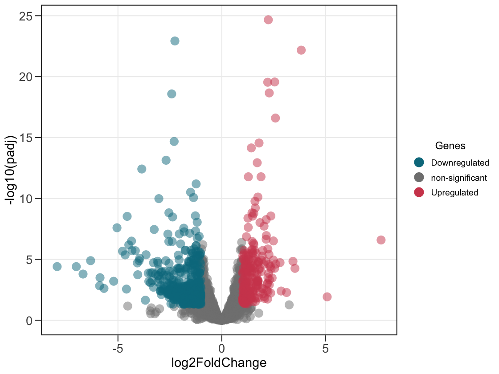

### 2. Add the genes of attention.

Supply a second data frame to outline and label the genes you care about.

``` r
ggvolc(all_genes, attention_genes)
```

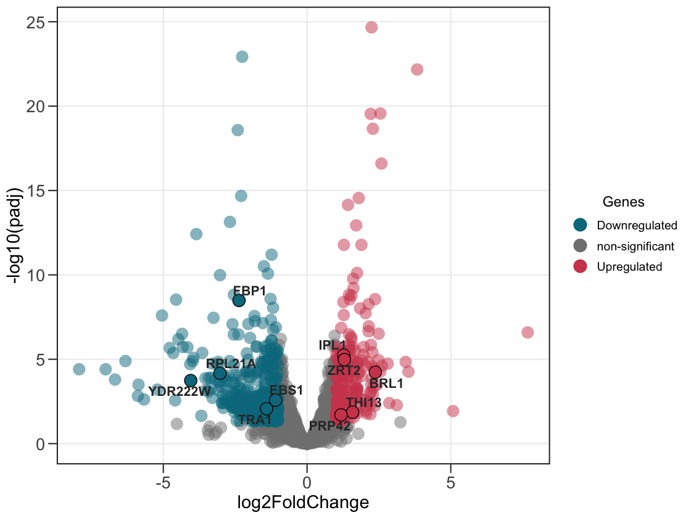

### 3. Add segments to indicate areas of significance.

Turn on `add_seg` to draw the fold-change and significance thresholds.

``` r
ggvolc(all_genes, attention_genes, add_seg = TRUE) +
  labs(title="Add segments of significance")
```

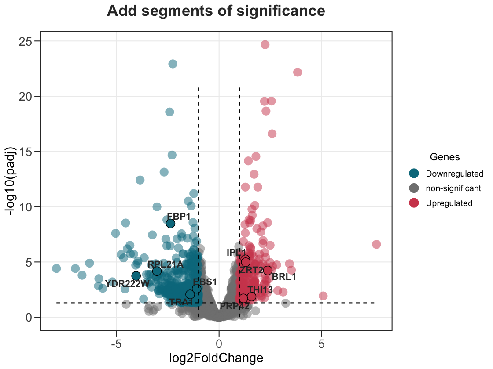

### 4. Indicate the size of point based on the log2FoldChange column.

Scale point size by effect size with `size_var = "log2FoldChange"`.

``` r
ggvolc(all_genes, attention_genes, size_var = "log2FoldChange", add_seg = TRUE)
```

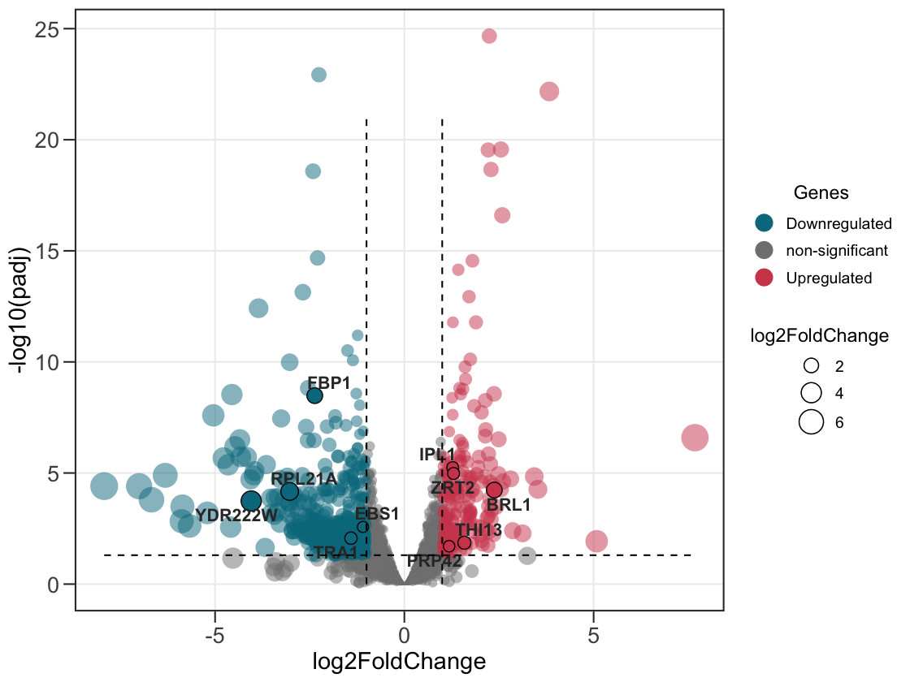

### 5. Indicate the size of the point based on the pvalue.

Or scale it by significance with `size_var = "pvalue"`.

``` r
ggvolc(all_genes, attention_genes, size_var = "pvalue", add_seg = TRUE)
```

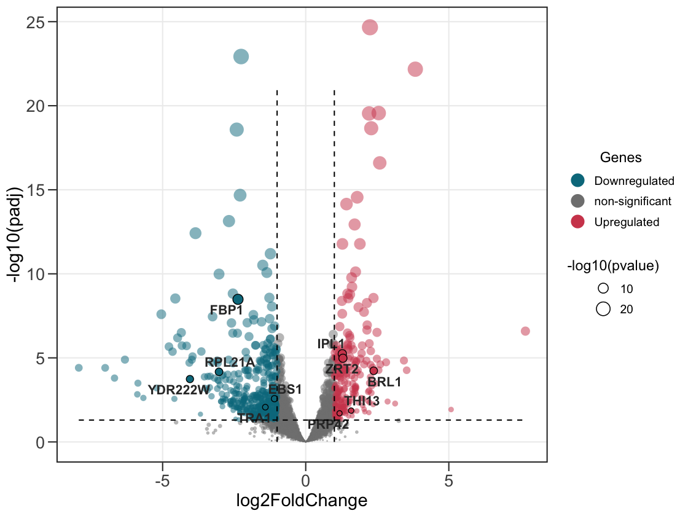

### 6. Add a table with the genes of interest.

``` r
plot <- ggvolc(all_genes, attention_genes, add_seg = TRUE) +
  labs(title="Add a table with the genes of interest")

plot %>%
  genes_table(attention_genes)
```

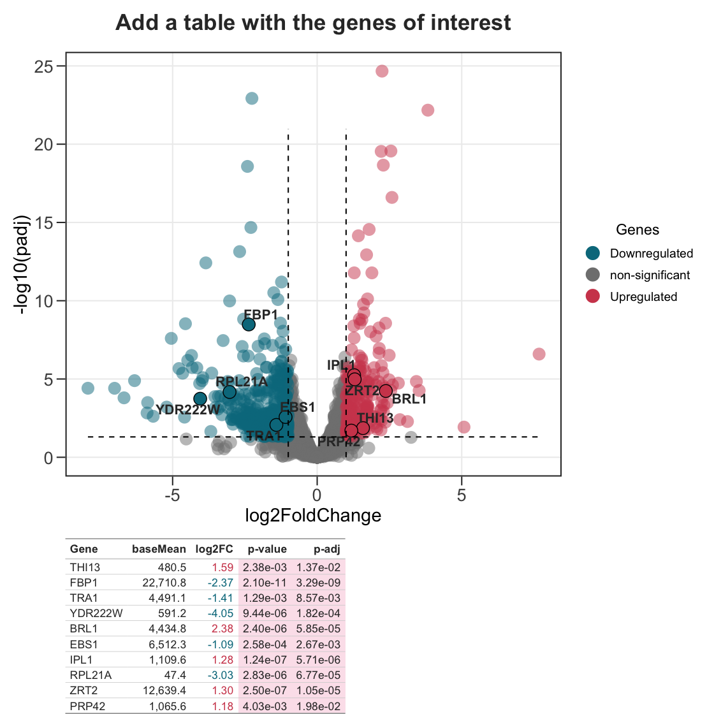

The gene table is rendered with [`gt`](https://gt.rstudio.com) and composed with
[`patchwork`](https://patchwork.data-imaginist.com), so the result is a single
object you can style further or save with `ggplot2::ggsave()`.

Instead of curating your own set of genes, you can let `genes_table()` pick the
most significant ones automatically with `top_n`. Pass the full DE table and it
selects the top genes by `sig_col` (defaults to `padj`, falling back to
`pvalue`). Use `dir = "each"` to take the top N up- *and* down-regulated genes.

``` r
plot_top <- ggvolc(all_genes, label_top = 10, add_seg = TRUE) +
  labs(title = "Top 10 most significant genes")

plot_top %>%
  genes_table(all_genes, top_n = 10)
```

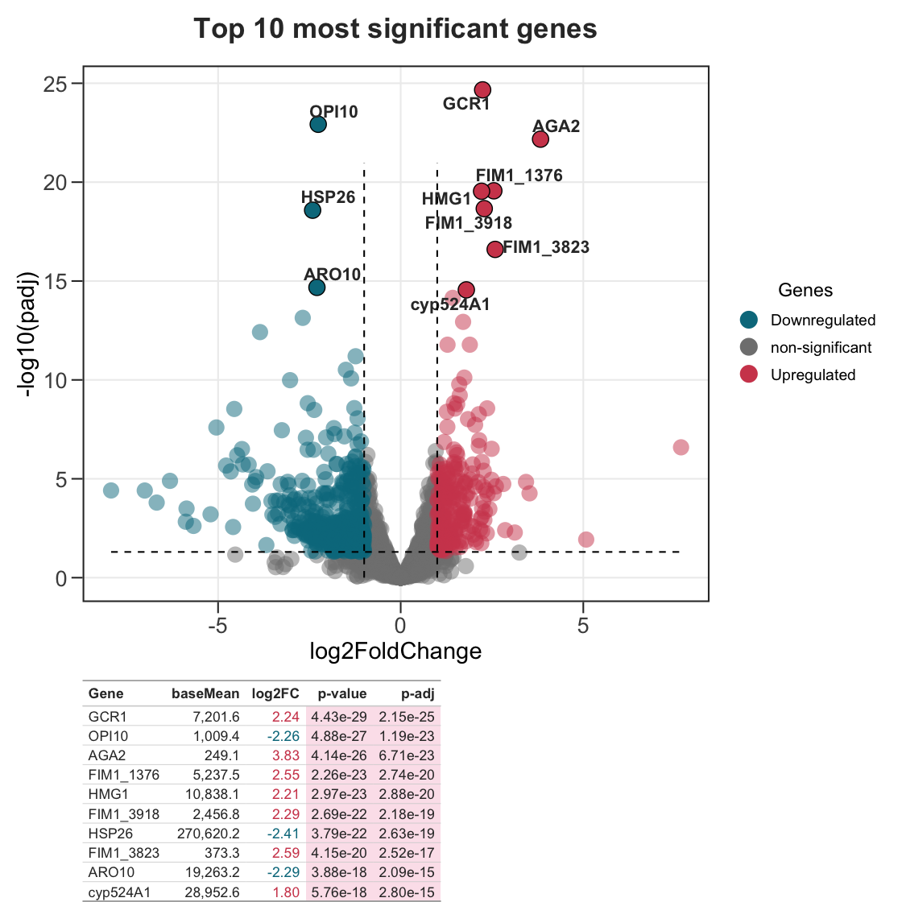

### 7. Works with DESeq2, edgeR, and limma out of the box

`ggvolc()` and `genes_table()` accept the output of all three major
differential-expression pipelines directly — column names are auto-detected and
mapped internally, so no manual renaming is needed. Gene identifiers held in row
names (as edgeR/limma often do) are promoted to a `genes` column automatically.

| Pipeline             | Fold change      | p-value   | adjusted p  | expression |
|----------------------|------------------|-----------|-------------|------------|
| DESeq2 (`results()`) | `log2FoldChange` | `pvalue`  | `padj`      | `baseMean` |
| edgeR (`topTags()`)  | `logFC`          | `PValue`  | `FDR`       | `logCPM`   |
| limma (`topTable()`) | `logFC`          | `P.Value` | `adj.P.Val` | `AveExpr`  |

The package ships `edger_genes`, an example `topTags()`-style table, so you can
see this directly. In your own analysis you would pass the real thing:

``` r
# edgeR: pass topTags()$table straight in
edger_res <- as.data.frame(edgeR::topTags(qlf, n = Inf))
ggvolc(edger_res)
```

``` r
data(edger_genes)          # an edgeR topTags()-style table (genes in the rownames)
head(edger_genes, 3)
#>           logFC  logCPM       PValue          FDR
#> GCR1   2.244064 12.8143 4.434241e-29 2.153711e-25
#> OPI10 -2.257454  9.9807 4.880607e-27 1.185255e-23
#> AGA2   3.829474  7.9665 4.143136e-26 6.707736e-23

ggvolc(edger_genes, label_top = 8, add_seg = TRUE, title = "edgeR input")
```

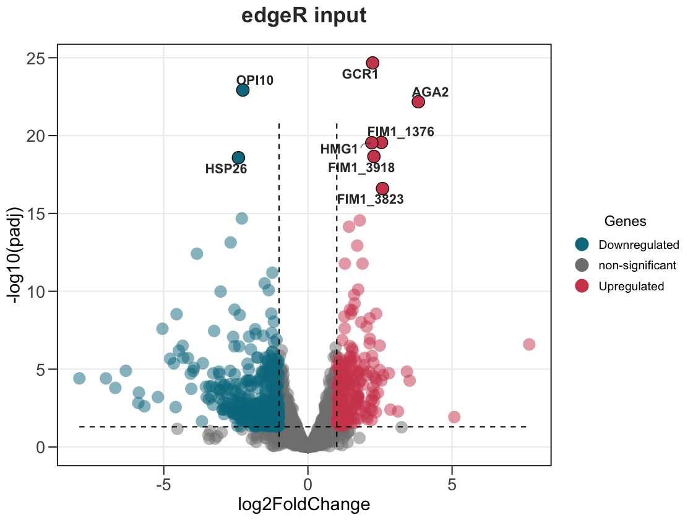

### 8. Significance on the adjusted p-value (FDR) — the default

`ggvolc()` calls significance on the **adjusted** p-value (FDR) by default — the
right cutoff for most DE workflows — and the y-axis and the significance line
follow along, so the plot stays consistent. Prefer the raw p-value? Set
`sig_col = "pvalue"`.

``` r
ggvolc(all_genes, add_seg = TRUE)   # significance on padj (FDR) by default
```

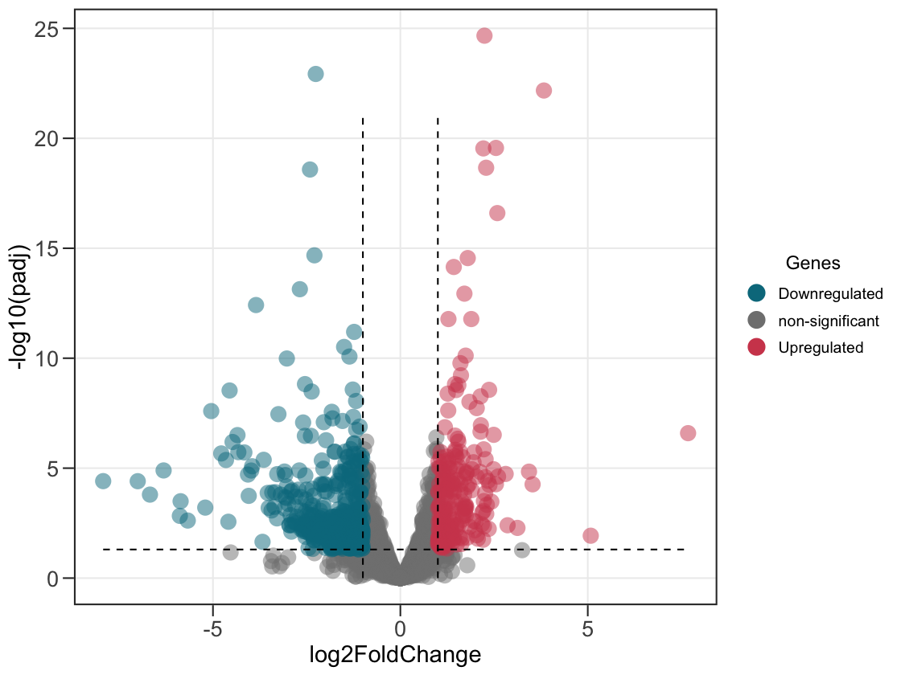

If your table has no adjusted-p column, ggvolc automatically falls back to the
raw p-value.

`ggvolc()` is also robust to p-values of exactly `0` (which DESeq2/edgeR can emit
for the strongest genes): instead of silently dropping them, their `-log10`
value is capped so they stay pinned near the top of the plot.

### 9. Automatically label the top genes

No need to build a separate data frame — `label_top` highlights and labels the N
most significant genes for you, and `label_dir` lets you pick the direction.

``` r
# top 10 overall
ggvolc(all_genes, label_top = 10, add_seg = TRUE, title = "Top 10 hits")
```

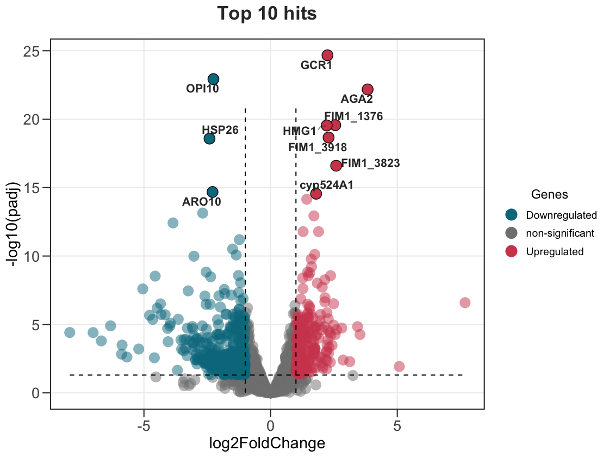

``` r
# top 8 up- and top 8 down-regulated
ggvolc(all_genes, label_top = 8, label_dir = "each", add_seg = TRUE,
       title = "Top 8 up + 8 down")
```

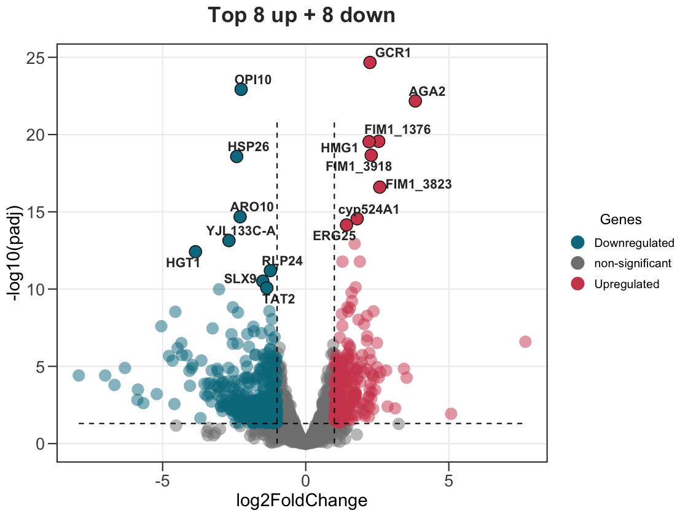

`label_dir` accepts `"both"` (default), `"up"`, `"down"`, or `"each"`.

### 10. Make it interactive

Set `interactive = TRUE` to get an [`ggiraph`](https://davidgohel.github.io/ggiraph/)
widget — hover any point to see the gene name and its statistics. `ggiraph` is an
optional dependency (install it with `install.packages("ggiraph")`).

``` r
ggvolc(all_genes, attention_genes, interactive = TRUE)
```

> **Note:** GitHub can’t run the widget, so the image below is a static preview.
> The live, hover-to-inspect version runs in RStudio and on the
> [package website](https://loukesio.github.io/ggvolc/articles/ggvolc.html).


## Learn more

- 📖 [**Package website**](https://loukesio.github.io/ggvolc/) — full function
  reference and a getting-started article with every example (including the live
  interactive volcano).
- 🐳 [**Docker image**](https://github.com/loukesio/ggvolc/pkgs/container/ggvolc)
  — `docker pull ghcr.io/loukesio/ggvolc:latest` for a ready-to-run RStudio
  environment with `ggvolc` pre-installed.
- 🐛 [**Issues & questions**](https://github.com/loukesio/ggvolc/issues) — bug
  reports and feature requests are welcome.
