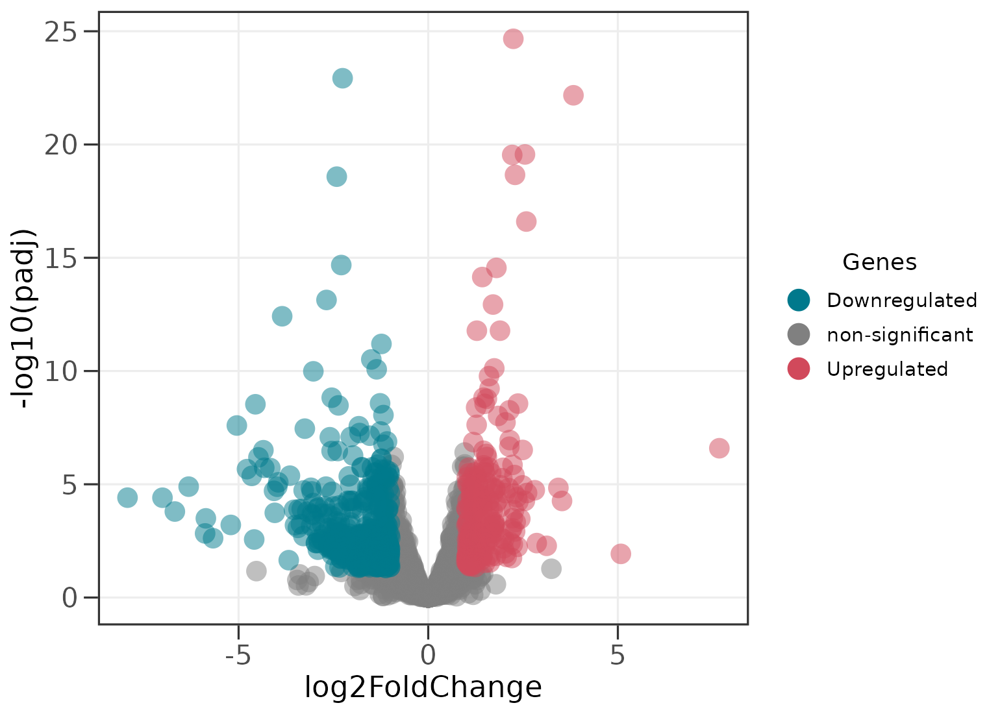
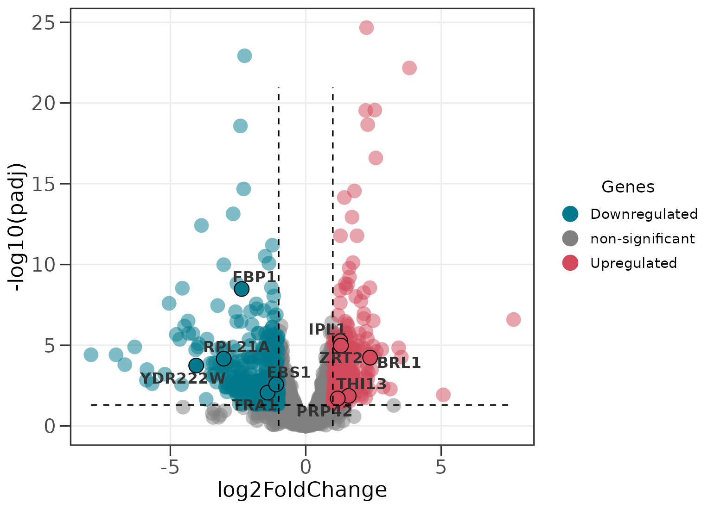
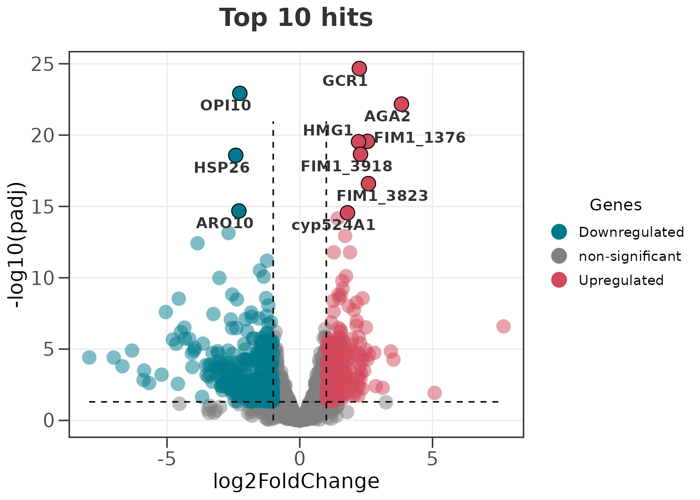
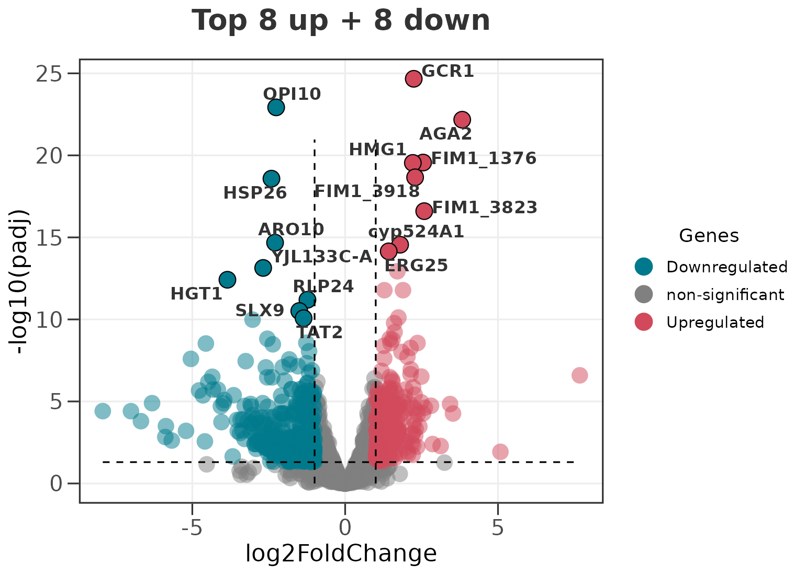
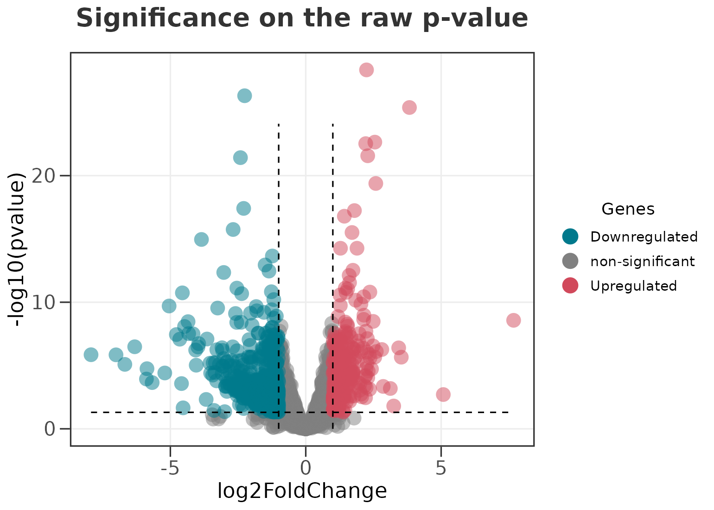
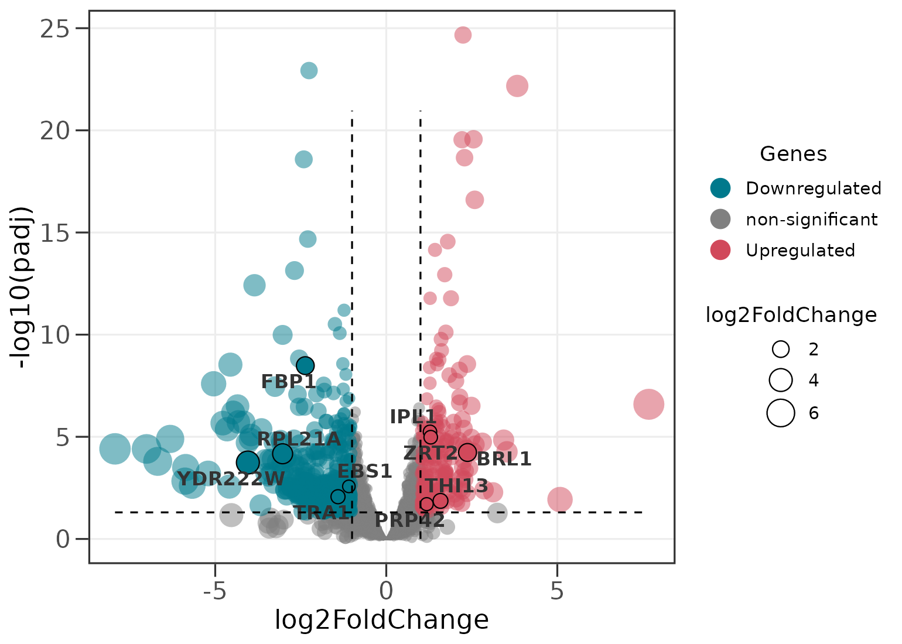
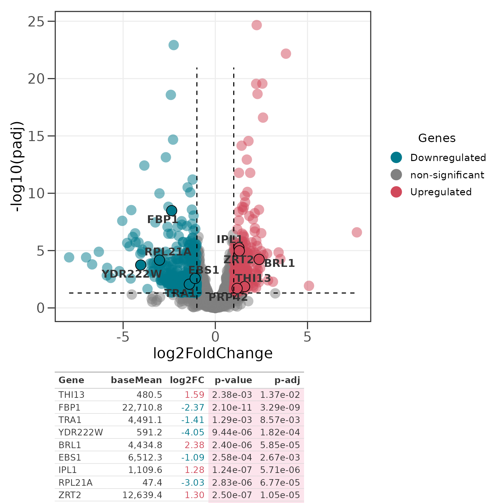
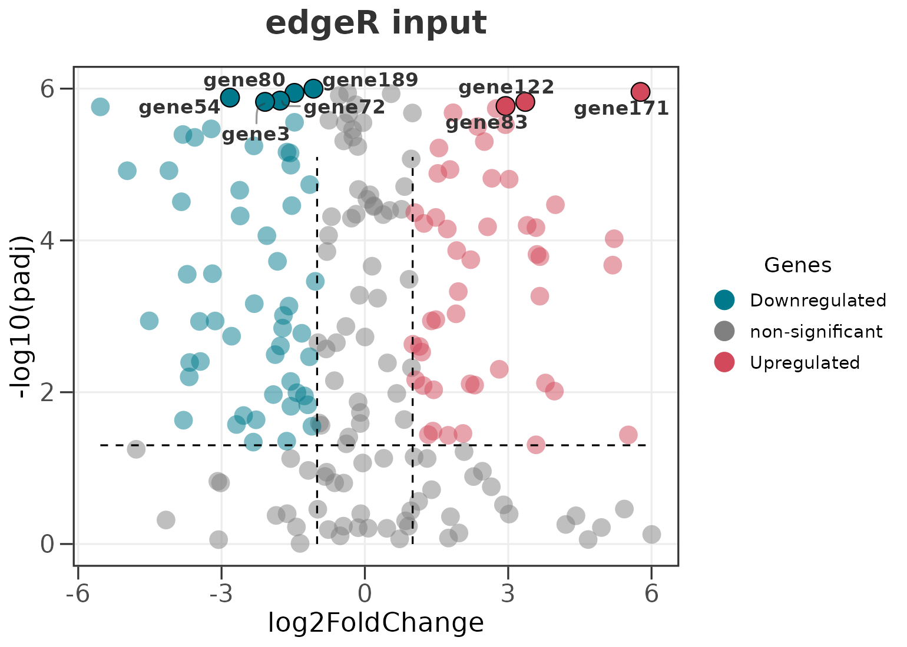

# Getting started with ggvolc

`ggvolc` turns the output of a differential-expression (DE) analysis
into a polished, publication-ready volcano plot. It accepts the output
of **DESeq2**, **edgeR**, and **limma** directly, highlights and labels
genes of interest, combines the plot with a `gt` table, and can render
an interactive version with `ggiraph`.

``` r

library(ggvolc)
```

## The example data

The package ships with two data frames. `all_genes` is a complete
DESeq2-style result table; `attention_genes` is a small subset of genes
you might want to highlight.

``` r

data(all_genes)
data(attention_genes)

head(all_genes)
#>       genes   baseMean log2FoldChange     lfcSE       stat       pvalue
#> 1      GCR1  7201.5782       2.244064 0.2004959  11.192564 4.434241e-29
#> 2     OPI10  1009.4171      -2.257454 0.2096469 -10.767889 4.880607e-27
#> 3      AGA2   249.1173       3.829474 0.3623263  10.569132 4.143136e-26
#> 4 FIM1_1376  5237.5035       2.550409 0.2560379   9.961059 2.256459e-23
#> 5      HMG1 10838.1037       2.214300 0.2229065   9.933763 2.968371e-23
#> 6 FIM1_3918  2456.8070       2.288243 0.2356228   9.711467 2.694309e-22
#>           padj
#> 1 2.153711e-25
#> 2 1.185255e-23
#> 3 6.707736e-23
#> 4 2.739905e-20
#> 5 2.883475e-20
#> 6 2.181043e-19
```

## A basic volcano plot

Passing a single data frame colours every gene by significance. By
default a gene is called significant when its **adjusted** p-value (FDR)
is below `0.05` and its `|log2FoldChange|` exceeds `1`.

``` r

ggvolc(all_genes)
```



## Highlighting genes of interest

Supply a second data frame and those genes are drawn with a black
outline and labelled.

``` r

ggvolc(all_genes, attention_genes, add_seg = TRUE)
```



The `add_seg = TRUE` argument adds dashed guides at the fold-change and
significance thresholds.

## Labelling the top genes automatically

You usually do not want to build a separate data frame just to label a
handful of hits. `label_top` picks the most significant genes for you,
and `label_dir` controls the direction they are drawn from.

``` r

# the 10 most significant genes overall
ggvolc(all_genes, label_top = 10, add_seg = TRUE, title = "Top 10 hits")
```



``` r

# the top 8 up- and top 8 down-regulated genes
ggvolc(all_genes, label_top = 8, label_dir = "each",
       add_seg = TRUE, title = "Top 8 up + 8 down")
```



`label_dir` accepts `"both"` (the default), `"up"`, `"down"`, and
`"each"`.

## Calling significance on the FDR (or the raw p-value)

[`ggvolc()`](https://loukesio.github.io/ggvolc/reference/ggvolc.md)
calls significance on the adjusted p-value (`padj`) by default, which is
the right cutoff for most DE workflows. The y-axis and the significance
line follow the choice, so the plot stays internally consistent. Switch
to the raw p-value with `sig_col = "pvalue"`.

``` r

ggvolc(all_genes, sig_col = "pvalue", add_seg = TRUE,
       title = "Significance on the raw p-value")
```



[`ggvolc()`](https://loukesio.github.io/ggvolc/reference/ggvolc.md) is
also robust to p-values of exactly `0` (which DESeq2 and edgeR can emit
for the strongest genes): rather than dropping those points, their
`-log10` value is capped so they stay near the top of the plot.

## Scaling point size

Point size can encode either the fold change or the significance.

``` r

ggvolc(all_genes, attention_genes, size_var = "log2FoldChange", add_seg = TRUE)
```



## Adding a gene table

[`genes_table()`](https://loukesio.github.io/ggvolc/reference/genes_table.md)
composes the volcano plot with a `gt` table of the highlighted genes
using `patchwork`. The result is a single object you can save with
[`ggplot2::ggsave()`](https://ggplot2.tidyverse.org/reference/ggsave.html).

``` r

p <- ggvolc(all_genes, attention_genes, add_seg = TRUE)
genes_table(p, attention_genes)
```



## Works with DESeq2, edgeR, and limma

Column names from all three pipelines are detected and mapped
automatically, so you can pass their output straight in. Gene
identifiers held in the row names (as edgeR and limma often do) are
promoted to a `genes` column for you.

``` r

# an edgeR topTags()-style table
set.seed(1)
edger <- data.frame(
  genes  = paste0("gene", 1:200),
  logFC  = rnorm(200, 0, 2.5),
  logCPM = runif(200, 2, 14),
  PValue = 10^-runif(200, 0, 8),
  FDR    = 10^-runif(200, 0, 6)
)

ggvolc(edger, label_top = 8, add_seg = TRUE, title = "edgeR input")
```



| Pipeline             | Fold change      | p-value   | adjusted p  | expression |
|----------------------|------------------|-----------|-------------|------------|
| DESeq2 (`results()`) | `log2FoldChange` | `pvalue`  | `padj`      | `baseMean` |
| edgeR (`topTags()`)  | `logFC`          | `PValue`  | `FDR`       | `logCPM`   |
| limma (`topTable()`) | `logFC`          | `P.Value` | `adj.P.Val` | `AveExpr`  |

## An interactive volcano

With the optional [`ggiraph`](https://davidgohel.github.io/ggiraph/)
package installed, `interactive = TRUE` returns a widget where hovering
a point reveals the gene name and its statistics.

``` r

ggvolc(all_genes, attention_genes, interactive = TRUE)
```
